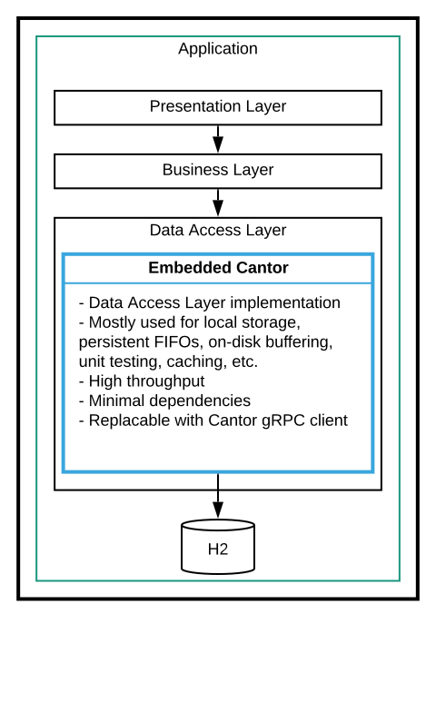

test
# Cantor

[](https://opensource.org/licenses/BSD-3-Clause)

Cantor is a *persistent data abstraction layer*; it provides functionalities to query and retrieve data stored 
as *key/value pairs*, *sorted sets*, *map of key/values*, or *multi-dimensional time-series data points*.

### Basics

**Cantor can help in simplifying and reducing the size of the data access layer implementation in an application**.

Majority of applications require some form of persistence. The *data access object* layer implementation usually
accounts for a considerable portion of the code in these applications. This layer usually contains code to 
initalize and connect to some storage system; a mapping to/from the layout of the data in storage and the 
corresponding representation in the application; and also, composing and executing queries against the storage, 
handling edge cases, handling exceptions, etc. This is where Cantor can help to reduce the code and its complexity.

Some of the commonly used patterns to access data are:

- Store and retrieve single objects; for example, storing user informations. The data stored is usually relatively small,
it can be a JSON object, or a serialized protobuf object, or any other form of data that can be converted to a 
byte array. Key/value storages such as BerkeleyDB or Redis are usually used for this purpose.

- Store and retrieve collections of data; for example, list of users in a certain group. Relational databases or 
indexing engines are usually used for this purpose.

- Store and retireve temporal data points; for example, metric values, or IoT events. Time-series databases such 
as Elastic Search, InfluxDB, OpenTSDB, or Prometheus are used for this purpose.

Cantor tries to provide a set of simple yet powerful abstractions that can be used to address essential needs for
the above mentioned use cases. The implementation focues more on simplicity and usability than completeness, 
performance, or scale. This is not a suitable solution for large scale (data sets larger than few tera-bytes) 
applications. It is also not recommended for high throughput (more than a hundred thousand operations per 
second) applications.

### Abstractions

The library allows users to persist and query data stored in one of the following forms:

- *Key/value pairs* - the key is a unique string and the value is an arbitrary byte array. This is consistent with
other key/value storage solutions: there are methods to create and drop namespaces, as well as methods to persist 
and retrieve objects. 

- *Sorted sets* - each set is identified with a unique string as the set name, and a number of entries, each 
associated with a numerical value as the weight of the entry. Functions on sets allow users to create and drop 
namespaces, as well as slice and paginate sets based on the weight of the entries.

- *Fat Events* - multi-dimensional time-series data points; where each data point has a timestamp along with an 
arbitrary list of metadata (key/value strings), a number of dimensions (double values), and a payload (arbitrary 
byte array).

These data structures can be used to solve variety of use-cases for applications; and they are straight forward to 
implement simply and efficiently on top of relational databases. Cantor provides this implementaion. It also tries to 
eliminate some of the complexities around relational databases, such as joins, constraints, and stored procedures. 
The aim of the library is to provide a simple and powerful set of abstractions for users to be able to spend more 
time on the application's business logic rather than the data storage and retrieval.

### Interfaces

There are four main interfaces exposed for users to interact with: the `Objects` interface for key/value pairs; 
the `Sets` interface for persisted sorted sets; and the `Events` interface for timeseries data.

All methods expect a `namespace` parameter which can be used to slice data into multiple physically separate databases.
A `namespace` must be first created by making a call to the `create(namespace)` method. It is also possible to drop the
whole namespace by calling `drop(namespace)` after which point any call to that `namespace` will result in `IOException`.

#### Objects

Internally, all objects are stored in a table with two columns; a string column for the key, and a blob column for the 
value; similiar to the table below:

Operations on key/value pairs are defined in the `Objects` interface:

- `create/drop` to create a new namespace (i.e., database) or to delete a namespace.
- `store/get/delete` to store, retrieve, and delete a single or a batch of key/value pairs.
- `keys` to get the list of all keys in a namespace; for example, calling `keys` against the above table would return a 
list of strings containing `{'object-key-1', 'object-key-2', 'object-key-3'}`.
- `size` to get the count of all objects stored in the namespace.

#### Sets

Sorted sets are stored in a table with three columns; a string column for the set name, a string column for the entry, 
and a long column for the weight associated to the entry; simliar to the table below:

Operations on sorted sets are defined in the `Sets` interface:

- `create/drop` to create a new namespace (i.e., database) or to delete a namespace.
- `add/delete` to add an entry with a weight to a set, or to remove an entry from a set.
- `entries/get` to retrieve entries or pairs of entry/weight from a set, where their weight is between two given values,
and are ordered either ascending or descending. It is also possible to paginate through the results. For example, 
calling `entries` for the `sample-set-1` against the above table returns a list of strings containing `{'entry-1', 
'entry-2', 'entry-3'}`; and calling `get` on the same, returns `{'entry-1' => 0, 'entry-2' => 1, 'entry-3' => 2}`.
- `union/intersect` to get the union or intersection of two sets.
- `pop` to atomically retrieve and remove entries from a set; this is particularly useful for using sorted sets as a 
producer/consumer buffer or similar usecases.

Most operations support ranges. A range is described as `count` entries with weight between a `min` and a `max` value, 
starting from the `start` index; for example making a `get` call similar to this: 
`get(namespace, 'sample-set-1', 1, Long.MAX_VALUE, 0, 3, true)` against the above dataset, returns maximum of 3 entries
from the `sample-set-1` where weight is between 1 and `Long.MAX_VALUE` starting from index 0, ordered ascending.

#### Events

Events represent multi-dimensional timeseries data points, with arbitrary metadata key/value pairs, and optionally a 
`byte[]` payload attached to an event.

Operations on events are defined in the `Events` interface:

- `create/drop` to create a new namespace (i.e., database) or to delete a namespace.
- `store` to store a new event in the namespace.
- `get` to fetch events in the namespace, matching a query; the queries are defined as a map of key/value pairs, where 
the key is either a dimension key name or a metadata key name (e.g., `Host` or `CPU` in the above example), and values 
are either literal values to match exactly with (e.g., `Tenant => 'tenant-1'`) or an operator along with a value (e.g., 
`Tenant => '~tenant-*'` or `CPU => '>0.30'`). Please see the javadoc for more detail on queries.
- `expire` to expire all events in the namespace with timestamp before some value.
- `count` to count number of events in the namespace, matching a query.
- `aggregate` to retrieve aggregated values of a dimension matching a query. Please see the javadoc for more detail on 
aggregation functions.
- `metadata` to retrieve metadata values for a given metadata key for events matching a query.
- `payloads` to retrieve `byte[]` payloads for all events in the namespace matching a query.

Events are internally bucketed into 1-hour intervals and stored in separate tables based on the different dimensions and 
metadata keys associated to an event. For example, an event with dimension `d1` and metadata `m1` is stored in a 
separate table than one with dimension `d2` and metadata `m2`.

Note that an event cannot contain more than 100 metadata and 400 dimension keys.

### How to use?

The projects is divided into a number of sub-modules to allow users to only pull in dependencies that are necessary.

### Embedded Cantor

To use the embedded Cantor library which is implemented on top of H2, include the following dependency:
```xml
<dependency>
    <groupId>com.salesforce.cantor</groupId>
    <artifactId>cantor-h2</artifactId>
    <version>${cantor.version}</version>
</dependency>
```
<p align="center">
  
</p>

#### On top of MySQL

To use Cantor on top of MySQL, include the following dependency:
```xml
<dependency>
    <groupId>com.salesforce.cantor</groupId>
    <artifactId>cantor-mysql</artifactId>
    <version>${cantor.version}</version>
</dependency>
```
<p align="center">
  
</p>

#### Why MySQL?

MySQL (or MariaDB) is a stable, performant, and scalable open source relational database, with very active community
and variety of tools and services around it.

#### Client/Server Mode

To use Cantor in a client/server mode, execute the `cantor-server.jar` similar to this:
```bash
$ java -jar cantor-server.jar <path-to-cantor-server.conf>
```

And include the following dependency on the client:
```xml
<dependency>
    <groupId>com.salesforce.cantor</groupId>
    <artifactId>cantor-grpc-client</artifactId>
    <version>${cantor.version}</version>
</dependency>
```
<p align="center">
  
</p>

More details on how to instantiate instances can be found in javadocs.

### Development

Clone the repository:
```bash
$ git clone https://github.com/salesforce/cantor.git
```

Compile like this:
```bash
$ cd cantor/
$ ./bang.sh
```
